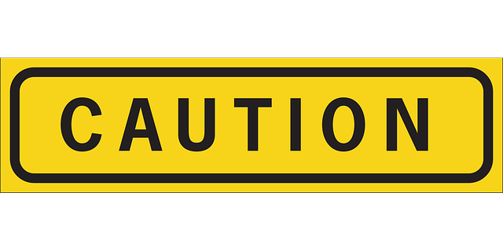

## The Scientific Research Team

The SMaHT Network comprises several specialized teams working together to drive the project forward and achieve its mission. Each team plays a vital role, in securing the successful collection, analysis, and sharing of data. The Coordinating Center manages program activities and outreach, while the Tissue Procurement Center oversees the collection and distribution of donor tissues. Within this, the ELSI Team provides guidance on ethical, legal, and social considerations. The Technology and Tool Development Team focuses on advancing methods for detecting DNA changes, and the Genome Characterization Centers generate and analyze data from collected samples. Finally, the Data Analysis Center ensures that the resulting somatic variant catalog is high-quality, accessible, and valuable for the broader research community. Together, these teams collaborate to ensure that SMaHT’s efforts are integrated, efficient, and impactful in advancing our understanding of somatic mosaicism.


 




A series of images featuring SMaHT network members engaging at the 2024 Annual Meeting. The images highlight group discussions, presentations, and candid moments of collaboration and connection.


The journey of groundbreaking research begins with the generosity of donors and their families that provide the invaluable gift of tissue donation. The SMaHT project is grateful to partner with several Organ Procurement Organizations (OPOs) that are essential for connecting donor families with this research opportunity. The OPOs involved in the SMaHT program are: ConnectLife, Gift of Life Donor Program, and LifeGift.







The extraordinary donations serve as the foundation for the many diverse research groups within the SMaHT project, fueling innovations that advance medical science. The SMaHT research team includes over 200 members from across the United States. Explore the graphic below to learn more about the different types of centers and groups that make up the SMaHT Scientific Team.



## SMaHT Scientific Website

Click the link below to be directed to the SMaHT scientific website.

<button id="id_reachout" class="to-main" onClick="showModal();">SMaHT Scientific Website</button>

    <!-- Modal content -->
        

            

            
<strong><em>Disclaimer</em></strong>: 

            
Content on the SMaHT Scientific website is intended for researchers and scientists and contains information and images that could be uncomfortable for donor families.

            <button class="to-main"><a href="https://smaht.org">Proceed to SMaHT Scientific Website</a></button>
            <button class="close to-main">Stay on SMaHT Family Donor Website</button>
            

        

